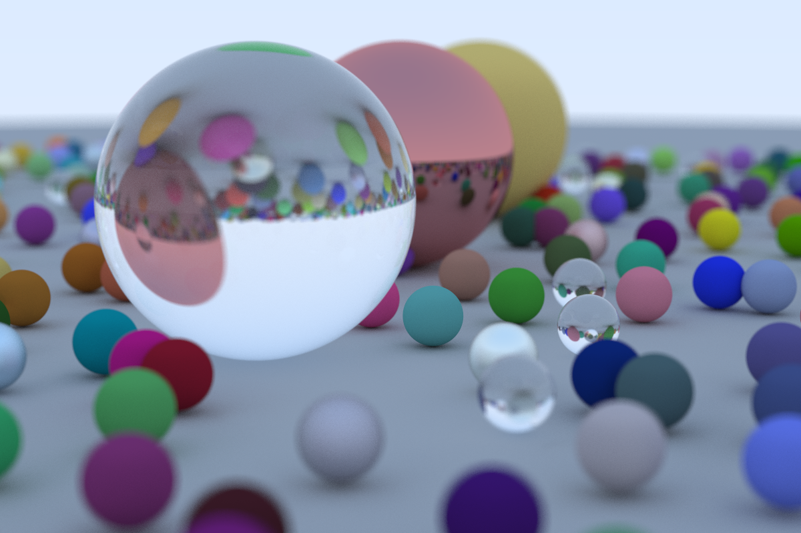

# DD1338 Week 13 | Raytracer

## Raytracing


The ++-group have a raytracing week during DD1337, before LINALG. This causes the work to be lacking in understanding due to 'us' not knowing any of the underlying math. Building raytracers are fun(!), but can be complicated!

By scheduling this over christmas, your're able to build everything from basic raytracers to complex monters of pure beauty. 

See:
- [Good raytracing tutorials by Peter Shirley](https://drive.google.com/drive/u/0/folders/14yayBb9XiL16lmuhbYhhvea8mKUUK77W),
- [Open-source raytracer with explination](https://tmcw.github.io/literate-raytracer/),
- [Compact raytracer in Javascript](https://www.gabrielgambetta.com/tiny-raytracer.html),
- [Raytracer tutorial with extensive math explinations](https://www.gabrielgambetta.com/computer-graphics-from-scratch/).

### Prepare Assignment

1) Create a repository named `task-13-<KTH_ID>`.
2) Clone your regular assignment repository.
    ```sh
    git clone git@gits-15.sys.kth.se:inda-25/<KTH_ID>-task-13.git
    ```
3) Add the upstream for `task-13-<KTH_ID>` to your local repository.
    ```sh
    git remote add plus git@github.com:IndaPlus25/task-13-<KTH_ID>.git
    ```
4) Implement a raytracer. 

**Goldstar** for the Rustacean who still stick to Rust. Rust is not mandatory in any way. See [indaplusplus19 - Eskil's raytracer](https://github.com/default-username-852/raytracer) in Rust.

**Note**: You may implement your solution using any language (this includes Python *_host_ psudokod *_host_ *_host_).

Goal:



### Grading

Because your solution can be implemented using any language, write in a README file of how to build and run your application (that includes how to run your frontend application).

**NOTERA(!)**: We demand readable raytracers, not compact ones!
